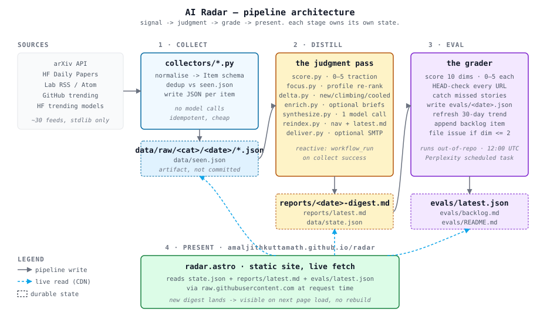

# AI Radar

Daily AI newsletter, built from ~30 sources, scored by a model, graded by a rubric.

Today's: [reports/latest.md](reports/latest.md) · Board: [amaljithkuttamath.github.io/radar](https://amaljithkuttamath.github.io/radar) · Score: [evals/latest.json](evals/latest.json)

## Eval trend (latest)

| date | quality | experience | overall | mode |
|---|---:|---:|---:|---|
| 2026-07-13 | 3.8 | 4.2 | 4.0 | recovery |
| 2026-07-12 | 4.2 | 4.2 | 4.2 | recovery |
| 2026-07-11 | 3.6 | 4.2 | 3.9 | recovery |
| 2026-07-07 | 3.8 | 3.6 | 3.7 | recovery |
[](https://github.com/amaljithkuttamath/ai-radar/actions/workflows/collect-corpus.yml)
[](https://github.com/amaljithkuttamath/ai-radar/actions/workflows/distill.yml)

## Architecture



Four stages, one repo, one writer per state.

1. **Collect.** stdlib fetchers pull arXiv, HF Daily Papers, lab RSS, GitHub trending, HF trending. Every item lands as JSON in `data/raw/`, deduped against `data/seen.json`. Daily at 11:00 UTC. No model calls, so a bad feed can't burn tokens.
2. **Distill.** Score the corpus (0–5 heuristic, stdlib), re-read traction for everything already on the radar, re-rank against `profile.yaml` topics, diff against yesterday to find movers, apply diversity filters, one model call to write `reports/<date>-digest.md`. Fires on `workflow_run` when collect finishes.
3. **Grade.** A separate daily task at 12:00 UTC reads the digest, HEAD-checks every URL, scores 10 rubric dimensions, commits `evals/<date>.json`, files an issue if any dimension drops below 2. The grader lives outside CI so it can't rescue a pipeline it just criticised.
4. **Present.** The Astro site reads `state.json`, `reports/latest.md`, and `evals/latest.json` live from `raw.githubusercontent.com`. New digest here shows up on next page load. No rebuild.

Details in [docs/architecture.md](docs/architecture.md). Decisions in [docs/architecture/adr/](docs/architecture/adr/).

## Invariants

- Collectors never call a model.
- `data/raw/` is regenerable and gitignored.
- Traction and relevance are different numbers.
- Each workflow writes a disjoint set of paths.
- Every eval score cites the item, URL, or file line that produced it.
- A traction number in the digest was read from its source during that run.
- "Climbing" means two observations of the same counter, not two guesses.

## The radar part

A newsletter tells you what happened today. A radar tells you what is still moving.

Items that make the digest go on the radar (`data/tracked.json`, capped at 60). Every run
re-reads their actual counters — GitHub stars, HF likes, HF paper upvotes — and re-enters them
as candidates scored against *current* signals. That is what makes "Climbing", "Cooled",
"Still developing" and "Story arcs" real: each one is backed by two observations of the same
number, days apart. Items leave the radar on a TTL, after three unreachable fetches, or once
traction goes flat for five runs.

It also means a quiet collection day still has something to say. Before this existed, roughly
30% of digests shipped with an empty main list, because the only candidates were the handful of
items first seen that morning.

Why it needed building: `data/seen.json` dedups an item forever and `data/raw/` is rebuilt from
scratch in CI, so an item was collected once and never seen again — every "since last run" diff
compared two disjoint sets. [ADR-0004](docs/architecture/adr/0004-carryover-tracking-ledger.md)
has the details.

## Layout

```
config/         sources.yaml, routines.yaml, profile.yaml (the three dials)
collectors/     source adapters, stdlib only
distill/        score, focus, track, delta, diversity, enrich, synthesize, reindex, deliver
tests/          pytest suite; no network, no model, no secrets
evals/          rubric, backlog, per-day JSON, latest.json
data/           raw/ (gitignored), seen.json, state.json, tracked.json
reports/        dated digests, README index, latest.md
scripts/        collect.sh, distill.sh, run.sh
.github/        collect-corpus.yml, distill.yml, test.yml
docs/           architecture.svg + architecture.md + adr/
```

## Run it locally

```bash
uv sync

python -m collectors.arxiv
python -m collectors.hf_papers
python -m collectors.lab_blogs
python -m collectors.github_trending
python -m collectors.hf_trending

WINDOW=48h \
FOCUS="interpretability,agents,evals" \
RADAR_MODEL_BACKEND=github \
bash scripts/distill.sh

open reports/latest.md
```

Backends: `github` (default, free, uses `GITHUB_TOKEN`), `anthropic`, `ollama`, `dryrun`.

## Tests

```bash
uv run --group dev pytest
```

No network, no model, no secrets — every fetch the pipeline makes is injected, so the suite
can't be flaked by a slow feed. `tests/test_pipeline.py` runs three simulated days through
score → track → synthesize under the exact CI conditions (empty `data/raw/`, everything
already in `seen.json`) that used to leave the radar with nothing to say.

## Runbook

**Collector 500s.** Log will show which feed. Others continued.

**"Quiet window" digest.** Manual dispatch of `distill` without a preceding `collect`. Expected. The main list should still carry tracked carryovers; a genuinely empty one means `data/tracked.json` is empty too.

**Nothing in "Still developing" / "Story arcs".** Check `data/tracked.json`. Empty means nothing has scored ≥3 since it was last pruned. Populated but every `streak` is 1 means re-observation is failing — the `[track]` line in the distill log gives `observed`/`missed` counts, and a high `missed` usually means a rate limit or an expired `GITHUB_TOKEN`.

**Eval scored ≤ 2.** Issue was opened automatically. `evals/<date>.json` has the justification. Fix is usually already in `evals/backlog.md`.

**Bad digest went out.** `git revert` the digest commit, run `python -m distill.reindex`, commit. Board catches up on next page load.

## Not this

Not investment advice. `MARKET=on` maps exposure, never suggests trades.

Not a firehose. Six items that matter beat forty that don't.

Not a leaderboard. The rubric grades this digest against itself over time.
