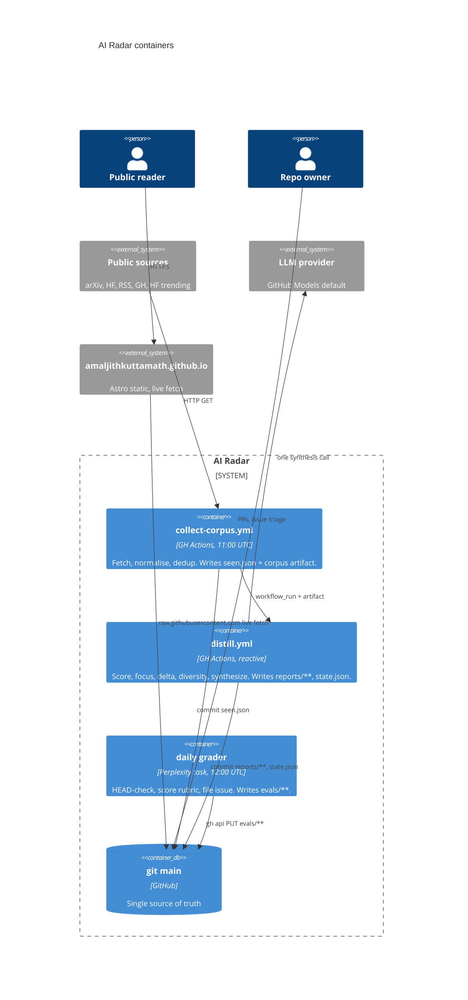
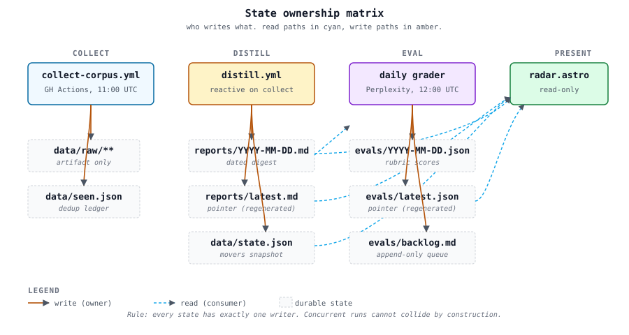
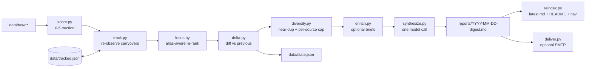
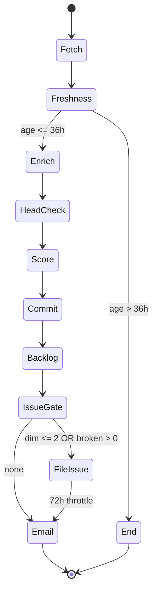
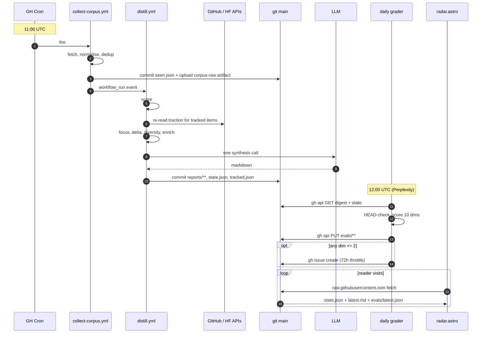

# Architecture

One design doc. If you need more depth, read the code or file an issue. Decisions that carry weight are in [adr/](architecture/adr/).

## System overview


Four containers, one repo, one writer per state file.



## State ownership



Every state file has exactly one writer. Concurrent runs can't collide by construction. This is [ADR-0001](architecture/adr/0001-disjoint-commit-paths.md).

| State | Owner | Consumers |
|-------|-------|-----------|
| `data/raw/**` | `collect` (artifact only) | `distill` |
| `data/seen.json` | `collect` | `collect` next run |
| `reports/**` | `distill` | `grader`, site, humans |
| `data/state.json` | `distill` | `distill` next run, site |
| `data/tracked.json` | `distill` | `distill` next run |
| `evals/**` | grader | site, humans |

## Distill internals



Per-module contracts:

- **`score.py`**. Pure function of `Item` and category rules. Same input, same output. No time-of-day, no state. `focus_match` is not part of the score.
- **`focus.py`**. Lexical alias-aware matcher over `profile.yaml`. `FOCUS` env overrides for one-off lenses. `FOCUS_BACKEND=embed` is stubbed.
- **`track.py`**. The radar's memory. Owns `data/tracked.json`: promotes digest-worthy items, re-reads their traction from the source of record every run (GitHub stars, HF likes, HF paper upvotes), and re-enters them as candidates re-scored against current signals. Prunes on TTL, consecutive misses, flat traction, and a size cap. Without it `delta.py` compares two disjoint sets and every change-over-time section is empty — see [ADR-0004](architecture/adr/0004-carryover-tracking-ledger.md). Bounded HTTP, no model, degrades to "no observation" on any failure.
- **`delta.py`**. Classifies items `new / climbing / cooled / steady` versus previous `state.json`. Uses traction magnitude (`hf_upvotes + gh_stars`), not `rank_key`, because rank saturates. `story_arcs()` reads `tracked.json`, not `state.json` — only the ledger accumulates a real streak.
- **`diversity.py`**. Near-duplicate title collapse (Jaccard on shingles, version tokens stripped) plus per-source cap (default 2). Stdlib. Rank order preserved. No-op with `DIVERSITY_JACCARD=1.0` or `MAX_PER_SOURCE=0`.
- **`enrich.py`**. Optional per-item briefs, one model call each. Off by default. Any brief that fails is dropped; digest still ships.
- **`synthesize.py`**. One model call. Prompt is `distill/digest.md` (version-controlled). Backends: `github` (default), `anthropic`, `ollama`, `dryrun`.
- **`reindex.py`**. Regenerates `reports/latest.md`, `reports/README.md`, and per-digest `prev · index · next` nav. Idempotent, delimited by `<!-- radar:nav -->` markers so it never stacks. Runnable standalone.
- **`deliver.py`**. SMTP push. No-op if any of `RADAR_EMAIL_TO`, `RADAR_SMTP_*` are missing. Delivery failure never fails the pipeline.

## Grader internals



## Rubric

Ten dimensions, 0–5 each, one-sentence justification per score. Full anchors in [`evals/rubric.md`](../evals/rubric.md).

**Answer quality (A).** `signal_density`, `source_integrity` (broken URL caps at 2), `focus_alignment`, `delta_clarity`, `coverage`.

**Experience (X).** `board_legibility`, `instrument_honesty`, `freshness`, `failure_surface`, `coupling`.

Aggregates: `quality.overall = mean(A1..A5)`, `experience.overall = mean(X1..X5)`, `overall = mean(quality, experience)`.

Issue filed when: any dim ≤ 2, or `broken_urls > 0`, or same dim ≤ 3 for 3 consecutive days. Throttled to one issue per 72h across `ai-radar` + `amaljithkuttamath.github.io`. See [ADR-0003](architecture/adr/0003-eval-loop-out-of-repo.md) for why the grader lives outside CI.

## Data contracts

**Item envelope** (every collector emits this shape):

```jsonc
{
  "id":          "arxiv:2406.01234",       // stable, <source>:<native-id>, used for dedup
  "category":    "research",
  "title":       "...", "url": "https://...", "source": "arXiv cs.LG",
  "authors":     ["..."],
  "published":   "2026-06-03T18:00:00Z",   // source-reported
  "fetched":     "2026-06-04T08:00:00Z",   // collector wall time
  "raw_summary": "...",
  "signals":     { "hf_upvotes": 0, "gh_stars": 0 },
  "score":       null,                     // set by score.py
  "focus_match": false,                    // set by focus.py; NOT part of score
  "delta_class": null                      // new | climbing | cooled | steady
}
```

**`state.json`** (movers snapshot, written by `delta.py`):

```jsonc
// Flat id -> snapshot map. Replaced wholesale each run; this is the previous run's scored
// set, not a durable history. `streak` here is vestigial — see tracked.json below.
{
  "arxiv:2406.01234": {
    "score": 4, "mag": 5.14, "title": "...", "url": "https://...",
    "streak": 1, "first_seen": "2026-07-06", "mag_history": [5.14]
  }
}
```

**`tracked.json`** (carryover ledger, written by `track.py` — [ADR-0004](architecture/adr/0004-carryover-tracking-ledger.md)):

```jsonc
// The radar's memory. Capped at 60 entries; every row is re-observed each run.
{
  "ghrepo:getzep/graphiti": {
    "id": "ghrepo:getzep/graphiti", "title": "...", "url": "https://...",
    "source": "GitHub Trending", "category": "releases",
    "links": {}, "summary": "...", "keywords": [],
    "first_seen": "2026-07-26",     // never overwritten
    "last_seen":  "2026-07-29",     // last run that actually observed it
    "streak":     3,                // consecutive runs OBSERVED (not merely remembered)
    "misses":     0,                // consecutive failed re-fetches; 3 => dropped
    "flat_runs":  0,                // consecutive runs with no traction gain; 5 => dropped
    "signals":    { "gh_stars": 29208 },   // latest observation, merged not replaced
    "mag_history": [5.14, 5.22, 5.39],     // one entry per observation
    "peak_mag":   5.39                     // used by the size cap and refresh ordering
  }
}
```

**`evals/<YYYY-MM-DD>.json`** (rubric artifact, written by grader):

```jsonc
{
  "date": "2026-07-06", "overall": 3.9,
  "quality":    { "overall": 4.0, "A1": {"score": 4, "why": "..."}, "...": "..." },
  "experience": { "overall": 3.8, "X1": {"score": 4, "why": "..."}, "...": "..." },
  "broken_urls": [], "missed_stories": [],
  "improvement_suggestion": { "target_repo": "ai-radar", "file_path": "...", "one_line": "...", "triggered_by": "X5" }
}
```

Fields are additive. Removals require a migration PR that updates every reader.

## Daily flow



## Failure modes

Documented modes and the response for each.

| Mode | Blast radius | Response |
|------|--------------|----------|
| Single-source 5xx | Missing items that day | No action for one blip; grader flags persistent regressions |
| Distill model call fails | No digest that day | Previous digest stays authoritative; rerun via `workflow_dispatch` |
| Bad digest ships | Public site shows it | `git revert` + `python -m distill.reindex` + commit |
| Grader escalates | Missing eval that day | Resolve ambiguity, patch task, dispatch recovery run |
| Grader token expired | No `evals/**` writes | Rotate PAT, update task credential |
| `raw.githubusercontent.com` down | Site offline | Repo remains authoritative; nothing to do |

The system fails degraded. Missing a feed, a model, or an eval never cascades past one layer.

## Security

Threats and defenses in one table.

| Threat | Defense |
|--------|---------|
| Prompt injection in source content | Items are Markdown, never HTML. Never interpolated into shell. Prompt treats items as data. |
| Hostile URL in digest | Grader HEAD-checks. Broken URL caps A2 at 2 and files an issue. |
| Model output XSS | Site renders through Markdown pipeline; `javascript:` URLs stripped. |
| Grader token leak | Perplexity task credential, never printed. Least-privilege PAT. Rotatable. |
| Workflow permission escalation | Repo defaults to `read-all`; per-workflow permissions pinned. Fork PRs can't use secrets. |

Out of scope: user accounts (none), encryption at rest (all public), multi-tenancy (single owner).

## Cost envelope

| Resource | Current | Free tier |
|----------|---------|-----------|
| GitHub Actions minutes | ~210/month | 2000/month (private) or unlimited (public) |
| GitHub Models calls | ~10/day (1 synth + ~9 grader) | ~500/day |
| Artifact storage | ~15 MB peak | 500 MB |
| Perplexity scheduled task | 1 run/day | Task-credit budget |

Sits inside free tiers by an order of magnitude.
