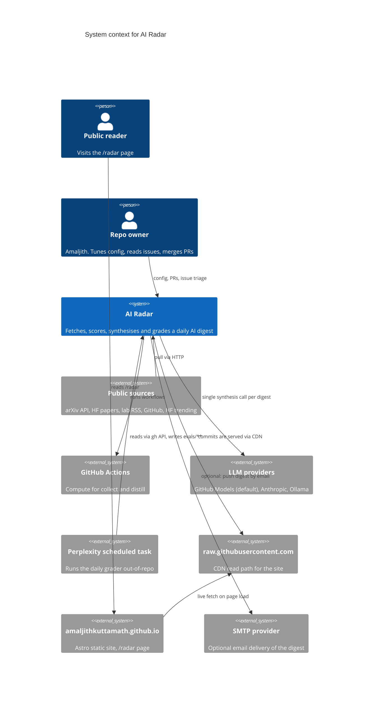

# 00. Context (C4 L1)

## What the system does

AI Radar produces a daily editorial digest of AI research and product signals, grades the digest against a fixed rubric, and renders both on a public page. One writer (the pipeline), one grader (external), one reader surface (the site), one human in the loop (the owner).

## System context diagram

## Actors

**Public reader.** Anonymous. Reads `/radar` and possibly `reports/latest.md` in the repo. No auth, no writes.

**Repo owner.** One person. Merges PRs, tunes `config/*.yaml`, closes issues the grader files. Only actor with write access to `main`.

**LLM provider.** The distiller makes one synthesis call per run, plus optional per-item briefs. Grader makes N judgment calls per run over the digest, one per rubric dimension. Both are treated as untrusted output (see [08-security.md](08-security.md)).

## External systems (with SLOs the design depends on)

| System | Depended-on SLO | Failure mode if breached | Mitigation |
|--------|-----------------|--------------------------|------------|
| arXiv API | ~99% daily availability | Missing research items that day | Continue with other collectors; next run backfills |
| HF Daily Papers HTML | Endpoint shape stable | Parser breaks; zero papers that day | Parser has structural fallbacks; grader catches via `A5 coverage` |
| Lab RSS feeds | Feed remains valid RSS/Atom | One feed contributes nothing | `feedparser` skips; log line only |
| GitHub Actions | Cron fires within 10 min of scheduled time | Digest late | Grader `X3 freshness` scores it; falls off SLO |
| GitHub REST | Rate limit: 5000 req/hr with token | Grader can't write artifacts | Retries with backoff; issue filed on repeated failure |
| GitHub Models | Default model routes to `gpt-4.1` | Synthesis quality drop | Backend swap via `RADAR_MODEL_BACKEND` env |
| raw.githubusercontent.com | CDN propagation ~5 min | Site shows stale data briefly | Documented; not a code path |

## Trust boundaries

Three boundaries. Each one has a threat surface enumerated in [08-security.md](08-security.md).

1. **Public sources → collectors.** Sources are treated as adversarial content. HTML/RSS is parsed with structural rules; item bodies never reach a shell or a database.
2. **Model output → committed artifacts.** The synthesis output is written verbatim to `reports/<date>-digest.md`. The grader HEAD-checks every URL before it becomes part of the digest's public record.
3. **Repo → site.** The site trusts anything committed to `main`. Only the owner and the two bot identities (`radar-bot`, `radar-eval-bot`) can push there.

## Deployment envelope

- **Compute.** GitHub Actions for the pipeline. External scheduled runner for the grader. No always-on servers.
- **Storage.** The git repo. `data/raw/` is passed between workflows as a 3-day retention artifact and never committed.
- **Cost.** Free tier for GitHub Actions and GitHub Models covers current cadence. See [06-deployment.md](06-deployment.md) for the envelope math.
- **Region.** Wherever GitHub Actions and the model providers run. Latency is not a design constraint.

## Not in scope of this doc

- **The site itself.** Astro app, Tailwind, deploy pipeline. Its README covers that. The seam is `raw.githubusercontent.com`; that is all this repo needs to know.
- **The Perplexity task's internals.** Only its contract matters: it reads via `gh api`, writes to `evals/`, files issues under the throttling rules in [03-components-eval.md](03-components-eval.md).
