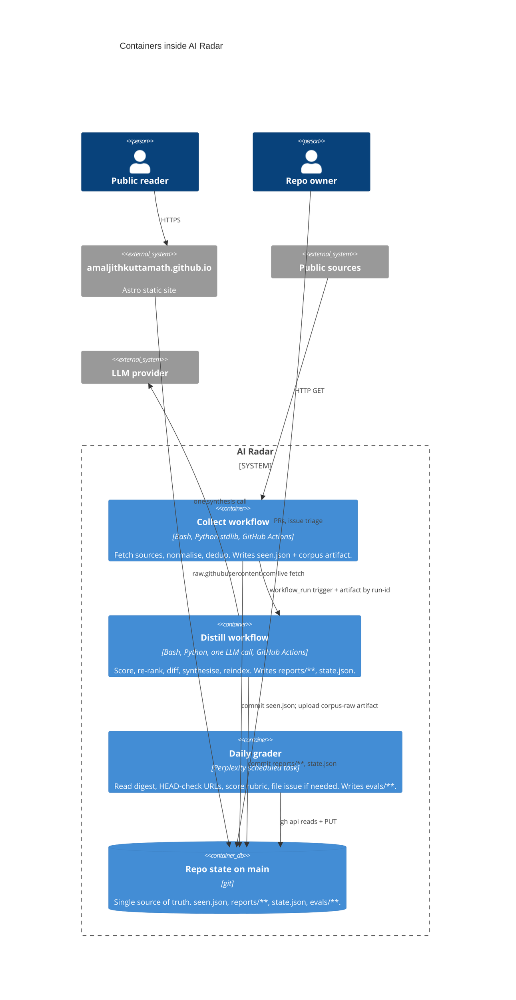

# 01. Containers (C4 L2)

Five containers. Each one is a deployable unit with a single owner, a single writer, and a single reason to change.

## Container diagram

## Container catalogue

### `collect` (`.github/workflows/collect-corpus.yml`)

**Purpose.** Deterministic ingestion. No model calls.

**Tech.** Bash entry point (`scripts/collect.sh`), Python stdlib fetchers under `collectors/`, one third-party dep (`feedparser`) for RSS/Atom.

**Trigger.** `schedule: 0 11 * * *` (11:00 UTC) plus `workflow_dispatch`.

**Reads.** Public source APIs and RSS feeds enumerated in `config/sources.yaml`. `data/seen.json` from the repo checkout.

**Writes.**
- `data/raw/<category>/<YYYY-MM-DD>/<id>.json`. Not committed. Uploaded as the `corpus-raw` artifact (3-day retention).
- `data/seen.json`. The dedup ledger. Committed.

**Concurrency.** `group: collect-corpus`. Serial.

**Idempotency.** Reruns are safe. `seen.json` guarantees no duplicate items across runs; `data/raw/` writes are atomic per-file with the item id as the filename.

**Fail modes.** Any single-source 4xx/5xx logs and continues. The whole workflow only fails on a repo push error or on a bug in `common.py`.

---

### `distill` (`.github/workflows/distill.yml`)

**Purpose.** The judgment pass. Everything expensive lives here.

**Tech.** Bash entry (`scripts/distill.sh`), Python for `score.py` / `focus.py` / `delta.py` / `synthesize.py` / `reindex.py` / `deliver.py`. Model call is backend-agnostic; default is GitHub Models via `GITHUB_TOKEN` and the `models: read` permission.

**Trigger.** `workflow_run` on `collect-corpus` success. Also `workflow_dispatch` for a manual re-distill without recollecting.

**Reads.**
- `corpus-raw` artifact from the triggering `collect-corpus` run, downloaded via `run-id`.
- `data/state.json` (previous run's movers snapshot).
- `config/routines.yaml`, `config/profile.yaml`.

**Writes.**
- `reports/<YYYY-MM-DD>-digest.md`. Committed.
- `reports/latest.md`, `reports/README.md`. Regenerated by `reindex.py`. Committed.
- `data/state.json`. New movers snapshot. Committed.

**Concurrency.** `group: distill`. Serial. Overlap with `collect` is safe because the write sets are disjoint (see [`diagrams/state-ownership.svg`](diagrams/state-ownership.svg)).

**Idempotency.** Rerunning against the same corpus produces the same score set. The synthesis call is not deterministic; the digest text will differ per run.

**Fail modes.** Model call is the failure-prone step. On non-2xx or timeout, the workflow fails and no digest is committed. The previous digest remains authoritative.

---

### `grader`. External Perplexity scheduled task

**Purpose.** Grade the digest against the 10-dim rubric. Enforce the improvement loop.

**Tech.** Perplexity scheduled task (background, cron `0 12 * * *` UTC). Uses `gh` CLI with a GitHub token for reads and writes. Uses `curl` for URL HEAD checks. Uses `search_web` and `fetch_url` for the "missed stories" enrichment pass.

**Trigger.** Time-based only. Not reactive to `distill`. Deliberate: the grader must be able to observe a stale or missing digest.

**Reads (via `gh api`).** `reports/latest.md`, previous dated digest, `data/state.json`, [`config/profile.yaml`](../../config/profile.yaml), any prior `evals/**` for trend context.

**Writes (via `gh api ... contents PUT`).**
- `evals/<YYYY-MM-DD>.json`. Full rubric object.
- `evals/latest.json`. Overwritten every run.
- `evals/README.md`. Rolling 30-day trend table.
- `evals/backlog.md`. Append-only. 1–3 items per run.
- GitHub issue if any dim ≤ 2 or a URL is broken. Throttled to one issue per 72h across `ai-radar` + `amaljithkuttamath.github.io`.

**Fail modes.** Escalates on ambiguity rather than guessing. Historical escalations documented in [07-reliability.md](07-reliability.md).

---

### `repo state`. Git tree on `main`

**Purpose.** Single source of truth for everything downstream reads.

**Tech.** git, on GitHub.

**Owners.**
- `radar-bot` writes `seen.json`, `reports/**`, `state.json` from within Actions.
- `radar-eval-bot` writes `evals/**` from the grader.
- Human owner writes `config/**`, `collectors/**`, `distill/**`, `evals/rubric.md`, `evals/backlog.md` structure changes.

**Contracts.** Every state file has exactly one writer. See [`diagrams/state-ownership.svg`](diagrams/state-ownership.svg) and [04-data-model.md](04-data-model.md).

---

### `site`. External Astro app (informative only)

Not part of this repo. Included in the container diagram because the read seam matters.

**Purpose.** Public `/radar` page.

**Reads.** `data/state.json`, `reports/latest.md`, `evals/latest.json` via `raw.githubusercontent.com`.

**Never writes to this repo.** Site is strictly downstream.

## Container-to-container contracts

| From | To | Protocol | Payload | Auth |
|------|----|----------|---------|------|
| `collect` | `distill` | `workflow_run` event + `actions/upload-artifact` | `corpus-raw` (3-day retention) | `GITHUB_TOKEN` |
| `distill` | repo | `git push origin main` | `reports/**`, `state.json` | `GITHUB_TOKEN` |
| `grader` | repo | `gh api PUT /repos/.../contents/<path>` | `evals/**`, issue body | Personal token via task credential |
| repo | site | `GET raw.githubusercontent.com/.../main/<path>` | JSON, Markdown | none (public) |

## Reasons to add a container

- **New signal class.** Social heat requires an interactive cadence (every 2h vs daily) and a distinct dedup ledger. New workflow: `collect-social.yml`. See [09-alternatives.md](09-alternatives.md) for why it isn't folded into `collect-corpus`.
- **Cross-source fusion.** A "trigger detected" event that fires when social heat crosses a threshold. New workflow: `fuse-and-detect.yml`. Emits `repository_dispatch` for downstream consumers.
- **Deep-dive assistant.** Reactive on `trigger_fired` or a labeled issue. New workflow: `deep-dive.yml`. Model-heavy, so it stays isolated from the daily pipeline.

Each new container is documented as its own file in this directory when it lands.
