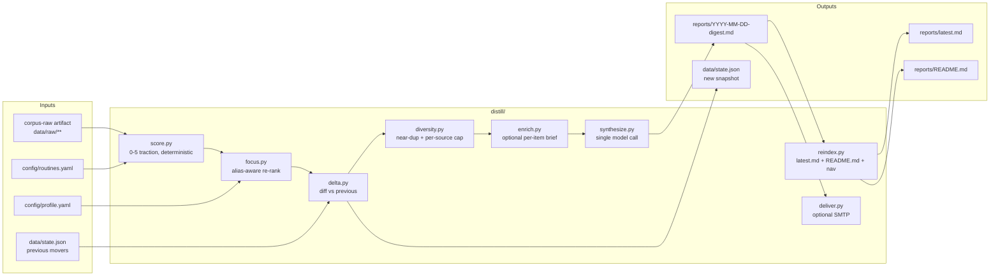

# 02. Distill internals (C4 L3)

The distill container is a linear pipeline over the corpus with one model call at the end.

## Component diagram

## Module reference

### `score.py`. Traction score

**Purpose.** Deterministic 0–5 score per item. Same input, same output.

**Inputs.** `Item.signals.hf_upvotes`, `Item.signals.gh_stars`, recency (`Item.published`), source authority tier, category floor.

**Output.** `Item.score: int` in `[0, 5]`.

**Invariants.**
- Pure function. No I/O, no time-of-day, no randomness.
- `focus_match` is not part of the score. That is `focus.py`'s job.
- Category floor prevents `research` from being drowned by `releases`. See `distill/score.py` for the exact bands.

### `focus.py`. Relevance re-rank

**Purpose.** Boost items that match the reader's profile without polluting the score.

**Inputs.** Scored `Item`s, `config/profile.yaml` (or the `FOCUS` env override).

**Output.** `Item.focus_match: bool`. Downstream sort key becomes `(score, focus_match, published)`.

**Matching rules.**
- Lexical, alias-aware. `interpretability` matches `mechanistic interp`, `SAE`, etc. via the aliases list.
- Case-insensitive. Whole-word. Word-boundary regex.
- Stdlib only. No embeddings.
- `FOCUS_BACKEND=embed` is a stub. Providing an embedder swaps the matcher without changing the interface.
- `FOCUS` env string overrides `profile.yaml` completely. Intended for one-off CI runs and A/B lenses.

### `delta.py`. Movers detection

**Purpose.** Classify each item as `new`, `climbing`, `cooled` versus the previous run.

**Inputs.** Current scored `Item`s, previous `data/state.json`.

**Output.** Adds `Item.delta_class: str` in `{"new", "climbing", "cooled", "steady"}`.

**Rules.**
- `new`: `Item.id` not present in previous `state.json`.
- `climbing`: traction magnitude (`hf_upvotes` + `gh_stars`) up ≥ 25% or score tier increased.
- `cooled`: traction magnitude down ≥ 25% or score tier decreased.
- `steady`: none of the above.
- Traction magnitude, not `rank_key`, because rank saturates: a 500→1000 star repo is a bigger story than 4990→5000 but rank_key can't tell.
- First run classifies everything as `new` and skips the "What changed" section entirely.

### `diversity.py`. Candidate-set diversity filters

**Purpose.** Keep one lab's release sweep or one over-productive collector from dominating the digest.

**Inputs.** Ranked candidate `Item`s.

**Output.** Filtered `Item` list. Rank order among survivors preserved.

**Two filters, applied in order.**

1. **Near-duplicate title collapse.** Shingle-based Jaccard on normalized title tokens. Version and size tokens (`9B`, `35B`, `GGUF`, `v2`, `2.5x`) are stripped so `Ornith-1.0-9B` and `Ornith-1.0-35B-GGUF` collapse into one exemplar. Top-ranked survives. Threshold `DIVERSITY_JACCARD` (default `0.6`).
2. **Per-source cap.** At most `MAX_PER_SOURCE` items from the same `source` string survive. Higher-ranked ones win. Default `2`. Set to `0` to disable.

**Invariants.**

- Stdlib only.
- Rank order among survivors is preserved.
- No-op with `DIVERSITY_JACCARD=1.0` or `MAX_PER_SOURCE=0`.
- Runs after `delta.py` and before `enrich.py`, so enrichment budget spends on the deduplicated set.

### `enrich.py`. Optional per-item briefs

**Purpose.** Add a paragraph of context per top-N item using a model.

**Guardrails.** `RADAR_AGENT=off` by default. `agent.top_n` and `agent.budget` in `routines.yaml` cap model calls. `agent.sleep_between` throttles.

**Failure mode.** Any single brief that fails is dropped. The digest still ships.

### `synthesize.py`. The one model call

**Purpose.** Turn scored + enriched `Item`s into a Markdown digest.

**Prompt.** [`distill/digest.md`](../../distill/digest.md). Version-controlled.

**Backend selection.** `RADAR_MODEL_BACKEND`:
- `github`. GitHub Models, free with `GITHUB_TOKEN` + `models: read`. Default in CI.
- `anthropic`. Reads `ANTHROPIC_API_KEY`.
- `ollama`. Local model. Useful for cheap drafts.
- `dryrun`. Skip the call. Emits a scaffolded digest with all headings and no synthesis. Used in workflow smoke tests.

**Output contract.** Markdown with these H2 sections in this order: `Top-line`, `What changed`, `Main list`, `Watch-list`, optional `Market exposure`, `Insights`, `Action items`. Sections may be empty but must exist so downstream parsers don't guess.

**Non-determinism.** The model call is the only non-deterministic step in the pipeline. Everything upstream is a pure function of the corpus + config.

### `reindex.py`. Reading aids

**Purpose.** Regenerate index files after a new digest lands.

**Rules.**
- `reports/latest.md` is a byte-for-byte copy of the newest dated digest.
- `reports/README.md` is a newest-first index with a one-line teaser per entry.
- Per-digest nav (`prev · index · next`) is idempotent: delimited by `<!-- radar:nav -->` markers and rewritten each run so it never stacks.
- Runnable standalone. `python -m distill.reindex` is a safe operation any time.

### `deliver.py`. Optional email

**Purpose.** SMTP push of the digest.

**No-op contract.** If any of `RADAR_EMAIL_TO`, `RADAR_SMTP_HOST`, `RADAR_SMTP_USER`, `RADAR_SMTP_PASS` are missing, the module exits 0 without logging an error. This is by design so forks don't fail on the missing secret.

**Delivery failure never fails the pipeline.** The digest is already committed by the time `deliver.py` runs.

## Invariants the container enforces

1. `Item.score` depends only on `Item` and category rules. Never on time-of-day or previous runs.
2. `Item.focus_match` is a boost, never in the score.
3. Every output artifact except the digest body is regenerable by rerunning `reindex.py`.
4. The only network call after `score.py` runs is the one synthesis call (plus optional briefs and optional SMTP).
5. `state.json` writes are the last step. If the workflow crashes before this, the next run's `delta.py` will treat everything as `new`, which is a safe degradation.
