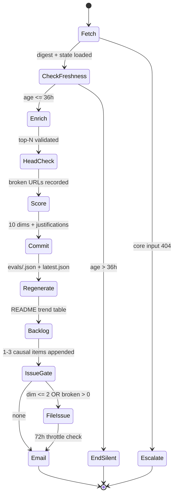

# 03. Eval internals (C4 L3)

The grader is a state machine driven by a scheduled trigger. It reads the pipeline's output, scores it, and files improvement items back into the repo.

## Why it lives outside the repo

If the grader ran inside `distill.yml`, a pipeline bug could suppress its own criticism. Independence is the whole point. See [`adr/0003-eval-loop-out-of-repo.md`](adr/0003-eval-loop-out-of-repo.md).

## State machine



## Rubric

Ten dimensions, five per axis, 0–5, with a one-sentence justification per score citing concrete evidence (an item id, URL, or file line). The rubric spec is at [`evals/rubric.md`](../../evals/rubric.md).

### Axis A. Answer quality

| Dim | Name | Signal | Anchors |
|-----|------|--------|---------|
| A1 | signal_density | Non-obvious insight per paragraph | 5: every line earns its space. 1: mostly restated abstracts. |
| A2 | source_integrity | Primary sources; no broken links | Any broken URL caps this at 2. |
| A3 | focus_alignment | Serves `profile.yaml` without echo chamber | 5: strong fit + one adjacent surprise. |
| A4 | delta_clarity | "What changed" is a real diff | 5: explicit new/climbing/cooled with reasons. |
| A5 | coverage | Inverse of missed 24h stories | 0 missed = 5; 3+ missed = 1. |

### Axis X. Experience and architecture

| Dim | Name | Signal | Anchors |
|-----|------|--------|---------|
| X1 | board_legibility | Cold reader gets top story in <10s | 5: top row is unambiguously the story. |
| X2 | instrument_honesty | Synthesis labeled as machine opinion | 5: observed signals visually dominate. |
| X3 | freshness | Hours from digest publish to eval | <6h=5, 6-12=4, 12-24=3, 24-36=2, >36=1. |
| X4 | failure_surface | One 4xx doesn't cascade | 5: isolated try/catch per fetch. |
| X5 | coupling | collect/distill/render stay separable | 5: strict boundaries. |

### Aggregates

- `quality.overall = mean(A1..A5)`
- `experience.overall = mean(X1..X5)`
- `overall = mean(quality.overall, experience.overall)`

## Backlog contract

Every run appends ≥ 1 causal improvement item to [`evals/backlog.md`](../../evals/backlog.md). Causal means the item is tied to the lowest-scoring dimension of the day. A generic wishlist item is a bug in the grader.

Item format:

```
- [ ] YYYY-MM-DD · <title> · <file path> , <2-sentence rationale>. Triggered by <dim + score>
```

Sections: `Open. Pipeline`, `Open. Presentation`, `Done`. Items move to `Done` with a closing date when the fixing commit lands on either repo.

## Issue-filing rules

An issue is opened only when at least one of these holds:

1. Any dimension scores ≤ 2.
2. `broken_urls.count > 0`.
3. The same dimension has scored ≤ 3 for 3+ consecutive days (persistent regression).

**Throttle.** At most one issue per 72 hours across `ai-radar` and `amaljithkuttamath.github.io` combined. The grader queries `gh issue list --author @me --limit 3 --json createdAt` on both repos and skips if the most recent bot issue is <72h old. The throttle is deliberately global so a bad day doesn't produce four issues.

**Issue body.** Failing dimension, score with justification, proposed fix with file path, link to the committed `evals/<date>.json`.

## Escalation contract

Rather than guess when reality doesn't match the instructions, the grader escalates. Historical escalations are the fastest way to spot a spec ambiguity.

Escalate when:
- A CORE input (digest, `state.json`, `profile.yaml`) returns 404.
- Digest age is on a threshold boundary and the instruction is ambiguous.
- The rubric would require fabricating a URL or a justification.

Do not escalate when:
- An OPTIONAL read (prior evals, backlog.md, rubric.md pre-merge) returns 404. Suppress and continue.
- Freshness is exactly 36.0h. Treat as fresh (see [ADR-0003](adr/0003-eval-loop-out-of-repo.md#freshness-edge-case)).

## Cost envelope

Each grader run makes:
- ~10 `gh api` GETs (digest, state, prior evals, backlog, radar.astro)
- ~20 `curl` HEAD checks (one per URL in the Main list)
- ~5–10 `search_web` / `fetch_url` calls for missed-story enrichment
- 1 primary model call for scoring + newsletter synthesis, plus the reasoning tokens for each dim
- Up to 4 `gh api PUT` writes (evals/<date>.json, latest.json, backlog.md, README.md)
- 0 or 1 `gh issue create`

At once-a-day cadence, this fits inside the Perplexity scheduled-task budget.
