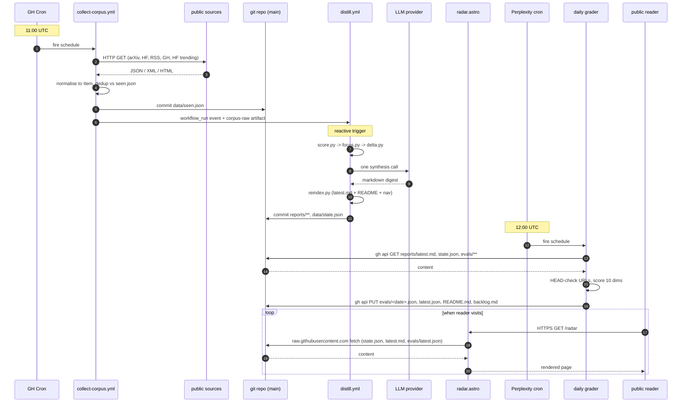
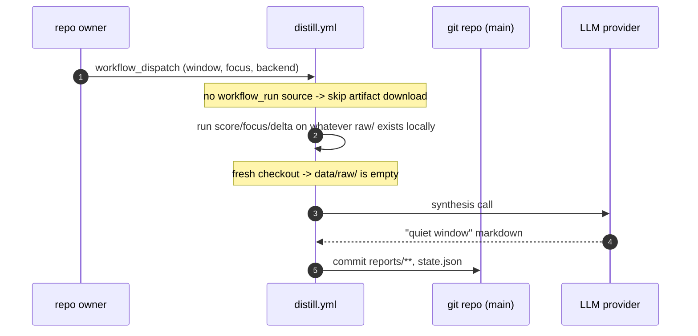
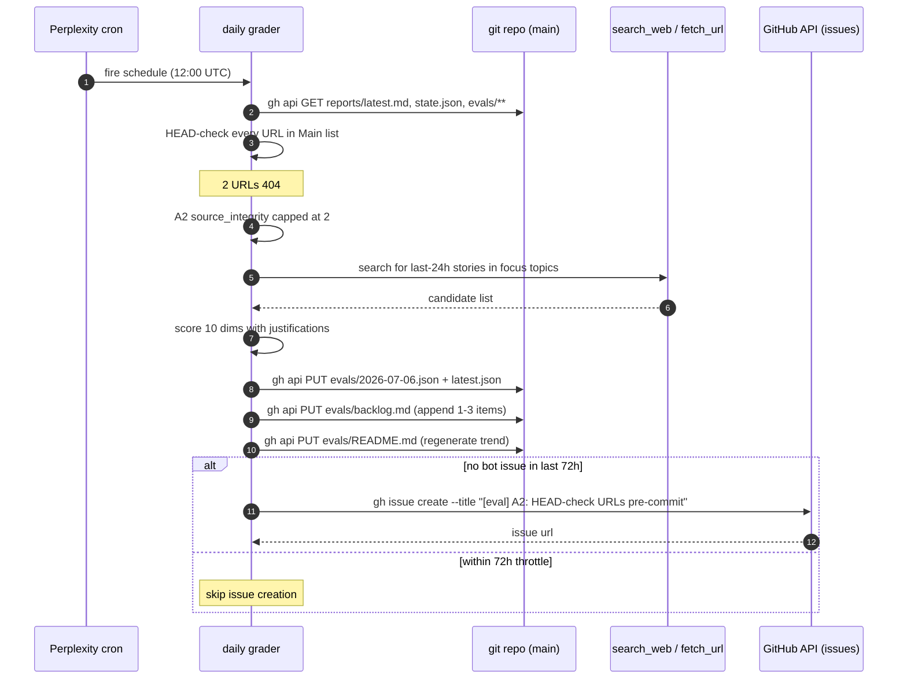

# 05. Flows

Three sequence diagrams. Everything else is one of these composed with itself.

## Flow 1. Daily happy path

## Flow 2. Manual re-distill (no re-collect)

Used when the digest needs to be rebuilt without paying to refetch. Example: tweaked the synthesis prompt.

Design note: the fresh checkout on `workflow_dispatch` yields an empty `data/raw/`. That produces a "quiet window" digest, which is the correct signal for a manual re-distill without a preceding collect. It is not a bug. If you want a full re-distill, dispatch `collect-corpus.yml` first and let its `workflow_run` trigger fire naturally.

## Flow 3. Eval finds a regression, files an issue

## Concurrency

- `collect-corpus` and `distill` never run in parallel with themselves (concurrency groups).
- `collect-corpus` and `distill` can run in parallel with each other. Write sets are disjoint (see [`diagrams/state-ownership.svg`](diagrams/state-ownership.svg)).
- Grader runs alone in its own runtime. Cannot collide with either workflow.
- Reader traffic is idempotent. No coordination needed with any writer.

## Retry model

Each container has its own retry semantics.

| Container | On failure |
|-----------|------------|
| `collect-corpus` | GitHub Actions no auto-retry. Next scheduled run backfills. |
| `distill` | GitHub Actions no auto-retry. Manual dispatch to re-run. |
| grader | Escalates on ambiguity; retries on transient `gh api` errors with exponential backoff. |
| site | Reader-side. Retries are up to the reader's browser. |
