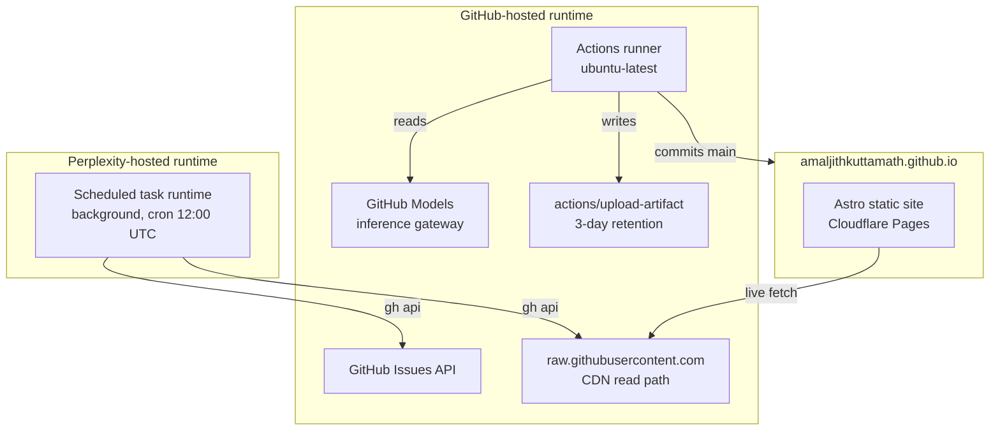

# 06. Deployment

## Runtime topology

## Secrets and IAM

| Secret / token | Owner | Scope | Used by |
|----------------|-------|-------|---------|
| `GITHUB_TOKEN` (built-in) | GitHub Actions | `contents: write`, `models: read` | `collect-corpus.yml`, `distill.yml` |
| Repo PAT for grader | Repo owner | `contents: write`, `issues: write` | Perplexity scheduled task |
| `RADAR_EMAIL_TO`, `RADAR_SMTP_*` | Repo owner | Repo secrets | `distill.yml` optional SMTP push |
| `ANTHROPIC_API_KEY` | Repo owner | Repo secret | `distill.yml` when backend = anthropic |

**Principle of least privilege.** No workflow requests write beyond what it commits. The grader's PAT could be scoped further (contents to `evals/**` only) if GitHub's fine-grained tokens supported path-level scopes; they don't yet, so the token has repo-wide `contents: write` and the code enforces the path constraint.

## Runners

- **Collect and distill.** `ubuntu-latest` on GitHub-hosted runners. `uv` is installed via `astral-sh/setup-uv@v7`. No matrix; a single job per workflow.
- **Grader.** Managed Perplexity runtime. `gh` and `curl` are preinstalled. Python for JSON manipulation.
- **Site.** Cloudflare Pages runs Astro's build. Not in the repo's runtime.

## Quotas and cost envelope

**GitHub Actions.** Free tier is 2000 minutes/month for private repos, unlimited for public. This repo is public. Actual usage: ~5 min/day collect + ~2 min/day distill = ~210 min/month.

**GitHub Models.** Rate limits by model tier. The default (`gpt-4.1`) is 500 requests/day for the free tier as of 2026. The pipeline uses ~1/day; briefs at `agent.top_n=8` and `agent.enabled=true` bring it to 9/day. Grader adds ~10/day. Well inside quota.

**Artifact storage.** `corpus-raw` at 3-day retention, ~5 MB/day of JSON. Peak ~15 MB. Free tier is 500 MB.

**Grader runtime.** Managed by Perplexity, budget tracked in scheduled-task credits. Not the repo's concern.

## Environments

There is one environment: `main`. Design decision documented in [ADR-????](adr/).

- No staging. The corpus is regenerable; a bad digest can be `git revert`ed in seconds; the site catches up on next page load.
- No feature flags. Behaviour changes go through PRs. Rollback is `git revert`.
- Config lives in the repo. No environment variables set outside CI, except optional SMTP.

## Deployment operations

**Fork setup.** Clone, set the grader token as a Perplexity task credential, optionally set SMTP secrets. That's it.

**Rotate the grader token.** Update the Perplexity task's credential; no code change.

**Rollback a bad digest.** `git revert <digest commit>` then `python -m distill.reindex && git commit -am "reindex" && git push`. Site catches up on next page load.

**Suspend the pipeline.** Disable the two workflows in the Actions tab, or delete the two cron schedules. `git push --force-with-lease` is not required.

**Wipe the corpus.** `data/raw/` is gitignored, so nothing to delete on the repo. Next collect run rebuilds from sources.
