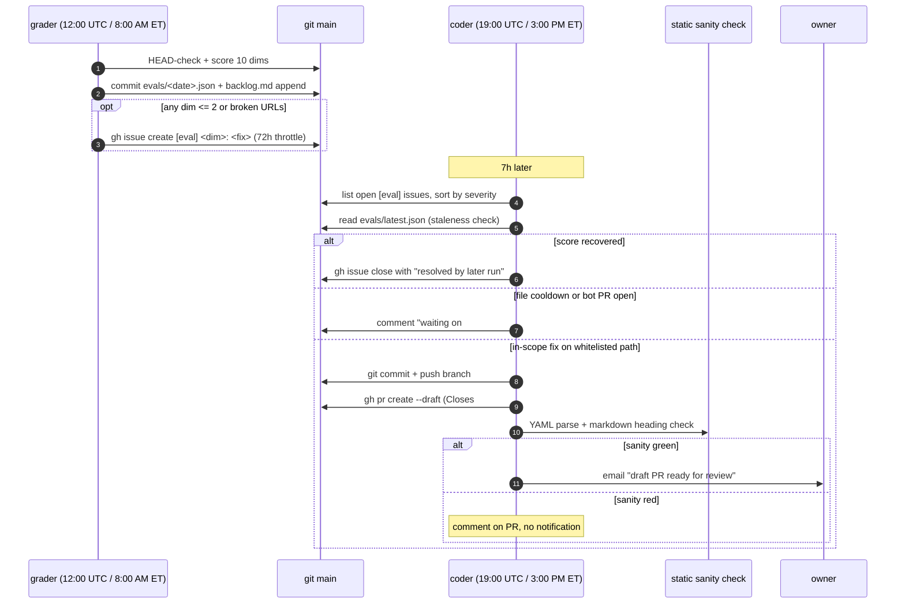

# Self-healing loop

Two scheduled tasks. One grades the digest, the other acts on failing grades.

## Roles

**Grader** (`AI Radar. Daily enriched newsletter + eval loop`, `cron_id: a86d03b2`). Runs 12:00 UTC (8:00 AM ET). Writes rubric scores, appends the backlog, files issues. Never changes code.

**Coder** (`AI Radar. Self-healing improvement loop`, `cron_id: 7c87ed62`). Runs 19:00 UTC (3:00 PM ET), seven hours after the grader so today's evidence is settled. Reads open issues, applies one fix if allowed. Never runs the rubric.

## Whitelist

Coder can only touch these paths:

- `config/sources.yaml` (source registry)
- `config/profile.yaml` (focus profile)
- `config/routines.yaml` (default distill params)
- `config/broken_sources.yaml` (new file allowed; blocked-domain ledger)
- `distill/digest.md` (synthesis prompt)
- `distill/brief_spec.md` (per-item brief prompt)
- `evals/backlog.md` (task tracking, direct commit only, no PR)

Anything else, coder appends a `[manual]` item to `evals/backlog.md` and exits.

## Failing-dim to allowed-edit

| Failing dim | Coder edit | File |
|-------------|------------|------|
| `A1 signal_density` | Add "why it matters" requirement per main-list item | `distill/digest.md` |
| `A2 source_integrity` (broken URLs) | Add domain to blocked-domain ledger; remove feed if listed | `config/broken_sources.yaml`, `config/sources.yaml` |
| `A3 focus_alignment` (echo chamber) | Widen alias set (never narrow) | `config/profile.yaml` |
| `A4 delta_clarity` | Tighten "What changed" instructions | `distill/digest.md` |
| `A5 coverage` (missed source repeatedly) | Add verified feed URL from `missed_stories` | `config/sources.yaml` |
| `X1..X5` (experience axis) | Backlog item only, no code PR | `evals/backlog.md` |

For A5, coder probes `<domain>/feed`, `<domain>/rss`, `<domain>/index.xml`, `<domain>/blog/rss`. Only adds a feed that returns 200 with valid RSS/Atom.

## Safety fences

1. **Draft PRs only.** Owner promotes to ready-for-review after inspection.
2. **Path whitelist.** Enforced in the coder task spec AND in [`.github/CODEOWNERS`](../.github/CODEOWNERS).
3. **Max 1 open bot PR.** Coder queries `gh pr list --author @me --label auto-improve --state open`; exits if any exist.
4. **Static sanity check.** After push, coder runs `yaml.safe_load` on every modified YAML and checks that modified Markdown files still have at least one heading. This repo has no PR-triggered CI (workflows fire on schedule / workflow_run), so the sanity check is the automated gate. Failure leaves the draft PR sitting with a diagnostic comment and no email.
5. **Staleness rule.** If the dim that triggered issue #N now scores > 3 in `evals/latest.json`, coder closes the issue instead of writing code.
6. **72h file cooldown.** If any bot PR touched file F in the last 72h (merged, closed, or open), coder won't touch F again until the cooldown expires.

## PR contract

Every coder PR:

- Opens as a **draft**.
- Title: `improve(<dim>): <one-line summary> [auto]`.
- Body includes `Closes #<issue>` so merging auto-closes the source issue.
- Labeled `auto-improve`.
- Committed by `radar-improve-bot <radar-improve-bot@users.noreply.github.com>`.
- One file's worth of intent per PR. Never batches unrelated fixes.

## Direct commits (no PR)

Two cases where coder commits directly to main without a PR:

- **X-axis dim handling.** Coder appends a `[presentation]` item to `evals/backlog.md` and closes the source issue.
- **Out-of-scope escalation.** Coder appends a `[manual]` item to `evals/backlog.md` and closes the source issue.

Both are backlog-only writes. They never touch code.

## How to shut it off

Delete the `AI Radar. Self-healing improvement loop` scheduled task (id `7c87ed62`). The grader keeps running; you just lose the auto-code step. Nothing else changes.

## Failure modes

**Coder opens a bad PR.** Close it. The 72h file cooldown prevents a re-attempt on the same file until it expires.

**Coder loops on the same dim.** Blocked by max-1-open-PR + 72h cooldown. If bad PRs keep merging anyway, merge discipline is the failsafe.

**Sanity check keeps failing.** Draft PR sits, no notification. Fix the coder's edit rule or close the PR.

**Grader stops filing issues.** Coder finds an empty queue, exits silently. No side effects.
This is the mode that actually happened, twice, and it is the quietest one on this list —
see *Is the loop closing?* below for what now measures it.

**Coder tries to touch a non-whitelisted path.** Aborts before git. Comments on the issue with the attempted path and files a `[manual]` backlog item.

## Is the loop closing?

Everything above describes a loop that turns. Nothing above can tell you whether it
*is* turning, and between 2026-07-13 and 2026-09-20 it was not — twice, for 28 days
and then for 41 more, while every individual component reported itself correctly.

The second stall is the instructive one, because nothing was broken:

| date | what happened |
|---|---|
| 2026-07-13 | grader writes its last `evals/latest.json`, then stops |
| 2026-08-10 | watchdog files issue [#34](https://github.com/amaljithkuttamath/ai-radar/issues/34), *Eval loop: grader last committed 28d ago* |
| 2026-08-11 | coder answers it with draft PR [#35](https://github.com/amaljithkuttamath/ai-radar/pull/35) |
| 2026-08-11 → 2026-09-19 | watchdog runs 15 more times, finds #34 already open, correctly declines to file a duplicate, exits 1 |
| 2026-09-19 | health reads `Eval loop 🔴 down · grader last committed 68d ago` |

Every one of those steps is the designed behaviour. The fault is what the table does
not contain: **no step measures the distance between rows two and five.** A detected
fault and a closed fault are different events, and the repo only ever measured the
first. An alarm ringing into an empty room for 41 days is indistinguishable, from
inside the system, from an alarm that was answered.

So `scripts/health.py` reports a fourth signal, `Self-healing loop`, measured from the
age of the oldest open `watchdog` issue:

- **ok** — no unanswered alarms.
- **warn** — an alarm is open but younger than 72h. A filed alarm is the loop
  *working*; it is not a fault while a fix may still be in flight. 72h is the coder's
  own file cooldown (fence 6), so this is the same clock the coder reasons with.
- **down** — an alarm has outlived that, meaning it survived at least three coder
  runs without producing a PR or a close.
- **unknown** — the Issues API could not be read. Never `ok`; also never escalated,
  because a watchdog that fires on its own blindness is one you learn to ignore.

Two deliberate properties:

**It measures the oldest alarm, not the count.** Three alarms filed this morning is a
busy day. One alarm filed six weeks ago is a loop that has stopped turning, and only
the second means the repo cannot be called self-healing.

**It does not try to fix anything.** The reporter/escalator split (ADR-0005) holds: the
signal flows into `--reasons`, the watchdog escalates on it, and no code closes an
alarm on the loop's behalf. A loop that could mark its own alarms answered would be
measuring its own homework.

### What it cannot see

The grader and coder are external scheduled tasks (ADR-0003). Nothing in this repo can
confirm those tasks still exist — only that their artifacts stopped arriving, which is
what the `Eval loop` signal says. If both signals are red, check the two `cron_id`s in
*Roles* before changing any code here.
