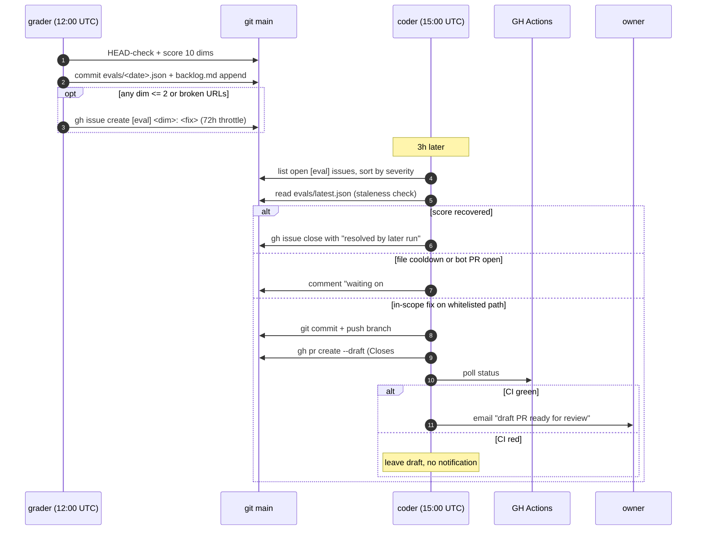

# Self-healing loop

Two scheduled tasks. One grades the digest, the other acts on failing grades.

## Roles

**Grader** (`AI Radar — daily enriched newsletter + eval loop`, `cron_id: a86d03b2`). Runs 12:00 UTC. Writes rubric scores, appends the backlog, files issues. Never changes code.

**Coder** (`AI Radar — self-healing improvement loop`). Runs 15:00 UTC, three hours after the grader so today's evidence is fresh. Reads open issues, applies one fix if allowed. Never runs the rubric.

## Whitelist

Coder can only touch these paths:

- `config/*.yaml` (source registry, focus profile, routines)
- `distill/digest.md` (synthesis prompt)
- `distill/brief_spec.md` (per-item brief prompt)
- `evals/backlog.md` (task tracking only, no code)

Anything else, coder appends a `[manual]` item to `evals/backlog.md` and exits.

## Failing-dim → allowed edit

| Failing dim | Coder edit | File |
|-------------|------------|------|
| `A2 source_integrity` (broken URLs) | Add domain to broken-source registry | `config/sources.yaml` |
| `A5 coverage` (missed source repeatedly) | Add feed URL from `missed_stories` | `config/sources.yaml` |
| `A3 focus_alignment` (echo chamber) | Widen alias set | `config/profile.yaml` |
| `A4 delta_clarity` | Tighten "What changed" prompt | `distill/digest.md` |
| `A1 signal_density` | Add "why it matters" requirement to synthesis | `distill/digest.md` |
| `X1..X5` (experience axis) | Backlog item only; no autonomous edit | `evals/backlog.md` |

## Safety fences

1. **Draft PRs only.** Owner promotes to ready-for-review after inspection.
2. **Path whitelist.** Enforced in coder task spec AND in [`CODEOWNERS`](../.github/CODEOWNERS).
3. **Max 1 open bot PR.** Coder queries `gh pr list --author @me --label auto-improve --state open`; exits if any exist.
4. **CI must pass.** Coder polls CI status; notifies owner only on green.
5. **Staleness rule.** If the dim that triggered issue #N now scores > 3 in `evals/latest.json`, coder closes the issue instead of writing code.
6. **72h file cooldown.** If a bot PR touched file F in the last 72h, coder won't touch F again until that PR resolves.

## PR contract

Every coder PR:

- Opens as a **draft**.
- Title format: `improve(<dim>): <one-line summary> [auto]`.
- Body includes `Closes #<issue>` so merging auto-closes the source issue.
- Labeled `auto-improve`.
- Committed by `radar-improve-bot <radar-improve-bot@users.noreply.github.com>`.
- One file, one intent. Never batches unrelated fixes.

## How to shut it off

Delete the `AI Radar — self-healing improvement loop` scheduled task. The grader keeps running; you just lose the auto-code step. Nothing else changes.

## Failure modes

**Coder opens a bad PR.** Close it. Coder respects the 72h file cooldown, so it won't re-attempt the same file until 72h pass.

**Coder loops on the same dim.** Impossible with max-1-open-PR + 72h cooldown, unless the owner keeps merging bad PRs. Merge discipline is the failsafe.

**CI is flaky and never goes green.** Coder leaves the draft PR sitting. No notification. You either fix CI or close the PR.

**Grader stops filing issues.** Coder finds an empty queue, exits silently. No side effects.
